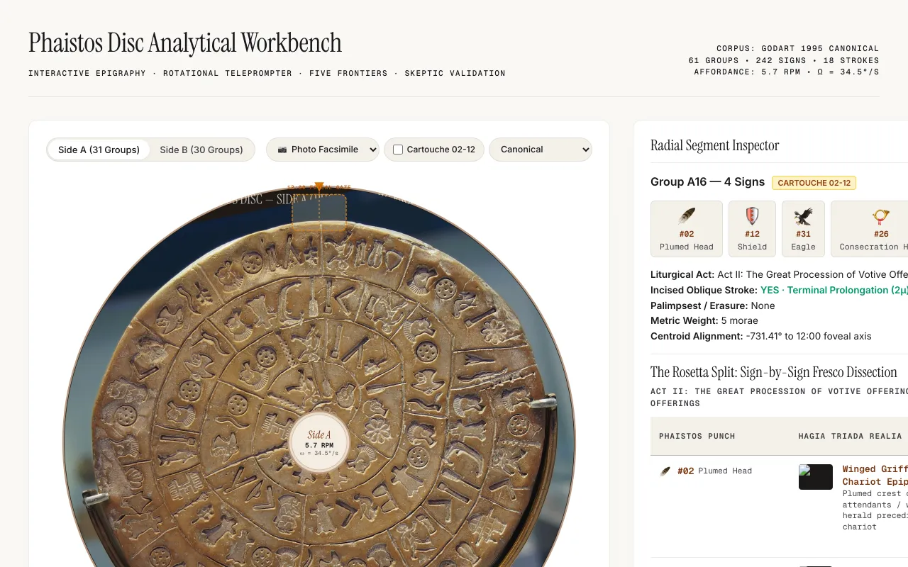
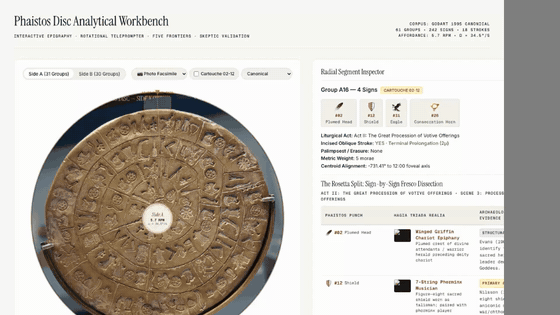

# Phaistos Disc Lab

[](https://www.python.org/)
[](tests/)
[](LICENSE)
[](METHODOLOGY.md)

**Version 0.2.0 — research preview**

[](https://lessthanzero.github.io/phaistos-disk/workbench/)

A small local-first side project for exploring the Phaistos Disc: interactive inspection, corpus tooling, and statistics that try hard not to fool themselves. This is **not** a decipherment claim and **not** an academic monograph.

Primary fun feature: generate and open the interactive workbench with `phaistos workbench`.

---

## What this lab is for

- Browse the Evans 45-sign catalogue and group transcriptions.
- Inspect physical observations (stamp overlaps, palimpsests, incised strokes) separately from interpretive readings.
- Run entropy / n-gram stats and Monte Carlo null checks.
- Generate a standalone HTML workbench for dual-face spiral inspection and optional audio playback.

It deliberately does **not** assume that the Disc is prose, that groups are words, that signs are syllabograms, or that Linear A/B unlocks the text.

See [METHODOLOGY.md](METHODOLOGY.md) for the evidence hierarchy, unicity bounds, and surrogate controls (the **Skeptic Rule**).

---

## Observation worth staring at

On Side A, groups **A16**, **A19**, and **A22** carry the **identical** four-sign sequence:

```text
02-12-31-26
```

(Evans numbers; often written with an accompanying oblique stroke on those groups.) That identity is an **L1 transcription fact** in the Godart-style edition used here — not a genre or language claim.

Everything else below (meter, refrain, hymn, ritual reading) is interpretive scaffolding built *around* that observation.

---

## Evidence tiers (short)

| Tier | Meaning | Examples |
|------|---------|----------|
| **L0** Observation | Clay marks, overlaps, palimpsests, stylus strokes | Stamp collisions; A05 / A08 / B01 palimpsests |
| **L1** Transcription | Evans 01–45, group boundaries | A16 = `02-12-31-26` |
| **L2** Palaeographic parallel | Visual resemblance only | Shape analogies to other Aegean scripts |
| **L3** Hypothesis | Phonetics, meter, genre, theology | Mora counts, “paean”, deity names |

An L3 story never upgrades into an L0/L1 fact. Details: [METHODOLOGY.md](METHODOLOGY.md).

---

## Working hypotheses (not established)

These are **research hypotheses** under active testing. Treat them as prompts for falsification, not results.

- **Mora / meter models** — Assigning mora weights to signs and looking for responsion on Side A (and stanza-like sums on Side B) can look structured under some coding choices. That does **not** prove a hymn meter; surrogate and look-elsewhere checks apply.
- **Genre (strophic hymn / paean-like)** — A poetic or performative reading of the repeating `02-12-31-26` groups is one plausible *story*. It is not demonstrated.
- **Religious / liturgical readings** — Invocations, deity names (including anything resembling Paiawon / “God”), offering contexts from Room 8 or Tablet PH 1, etc., are **interpretive overlays**. Do not cite this repo as establishing them.
- **Fabrication mechanics** — Cord-and-pin spiral drafting and outside-in stamping are **models** fitted to geometry and overlap data; strong fit ≠ exclusive proof of workshop practice.
- **Clay provenance** — Local Mesara-style fabric is a **comparative petrographic hypothesis**. Do not treat percentage matches or “local Crete proven” slogans as settled geology.
- **Comparative Linear A / suffix grids** — Likelihood ratios and SVD factorizations are exploratory; they do not confirm sound values.

Falsifications of popular claims (Saros calculator, Mehen board, modern forgery, etc.) are likewise **provisional lab results**: useful as stress tests, not courtroom verdicts. Prefer reporting surrogate ranks and effect sizes over “p = 0.0000 proves X.”

---

## Interactive workbench

[Live demo on GitHub Pages](https://lessthanzero.github.io/phaistos-disk/workbench/)



```bash
uv run phaistos workbench --output reports/workbench.html
# Public / GitHub Pages build (Commons CC BY-SA disc facsimiles; no local museum WebPs):
uv run phaistos workbench --output site/workbench/index.html --pages-safe --no-open-browser
```

Opens a standalone HTML explorer (dual-face SVG spiral, group inspection, optional Karplus–Strong-style audio hooks). Full local builds may embed optional undocumented museum photos as data URIs; `--pages-safe` builds use relative Wikimedia Commons disc facsimiles and Hagia Triada realia crops (CC0 / CC BY-SA 4.0 — see [docs/media/ATTRIBUTION.md](docs/media/ATTRIBUTION.md)).

After the repo is on GitHub, enable **Settings → Pages → Source: GitHub Actions**. The `pages.yml` workflow deploys a rights-safe demo to `https://{owner}.github.io/phaistos-disk/`.

Third-party museum photographs under `reports/visuals/photos/` remain **excluded from the public default tree**; see [NOTICE](NOTICE). Do not assume MIT covers third-party media.

---

## Quickstart (uv)

Requires Python **3.12** or **3.13** and [`uv`](https://docs.astral.sh/uv/).

```bash
git clone https://github.com/lessthanzero/phaistos-disk.git
cd phaistos-disk
uv sync
uv run pytest
```

Useful first commands:

```bash
uv run phaistos validate
uv run phaistos signs
uv run phaistos stats
uv run phaistos epigraphy
uv run phaistos prosody          # metrical *hypotheses* — read output skeptically
uv run phaistos workbench        # interactive UI
```

Heavier batteries (many surrogates) belong on a batch machine; see dual-machine notes below.

---

## CLI (brief)

| Command | Role |
|---------|------|
| `phaistos validate` | Corpus / invariant checks |
| `phaistos signs` | Evans catalogue |
| `phaistos stats` | Entropy / n-grams |
| `phaistos epigraphy` | Overlaps, palimpsests, strokes |
| `phaistos prosody` | Mora / responsion **hypotheses** |
| `phaistos strokes` | Oblique-stroke audits |
| `phaistos tablet-ph1` | Nearby Linear A tablet PH 1 |
| `phaistos workbench` | Generate interactive HTML |
| `phaistos deep-six --surrogates N` | Multi-frontier surrogate battery |

Full command list: `uv run phaistos --help`.

---

## Dual-machine compute (optional)

Interactive work on macOS; long Monte Carlo sweeps on a Fedora worker (`pc`) if you have one:

```bash
./scripts/sync_artifacts.sh pc push
./scripts/remote_worker.sh pc "uv run pytest"
./scripts/remote_worker.sh pc "uv run phaistos deep-six --surrogates 5000"
./scripts/sync_artifacts.sh pc pull
```

Keep single-process memory modest (worker class ~16 GB).

---

## Repository layout

```text
phaistos-disk/
├── corpus/                 # Transcriptions, physical observations, comparative YAML
├── src/phaistos/           # Library + Typer CLI
├── tests/                  # pytest suite
├── scripts/                # remote_worker.sh, sync_artifacts.sh
├── experiments/            # Run logs; generated audio (local)
├── reports/                # Generated workbench / SVGs (local; photos often excluded)
├── METHODOLOGY.md          # Skeptic Rule, unicity, surrogates
├── NOTICE                  # MIT code vs media carve-outs
└── pyproject.toml          # package metadata (0.2.0)
```

Raw corpus under `corpus/` is treated as immutable evidence encoding — do not “fix” L0/L1 to fit a reading.

---

## Licensing

- **Code** (and original generated SVG / synthesized WAV produced by this project): [MIT](LICENSE).
- **Media carve-outs**: third-party photos and some Wikimedia-derived material are **not** MIT-relicensed and may be absent from the public tree. See [NOTICE](NOTICE).

Keep NOTICE with redistributions.

---

## Acknowledgments

Release hygiene and tooling were assisted by **Cursor Agent (Composer)**, **Codex (GPT-5.6)** (peer-review / critique), **Antigravity 3.8 Flash**, and local **Ollama** models (`qwen2.5`, `gemma2`, `qwen2.5-coder`) for adversarial review. Scientific claims remain the author’s; see [docs/OUTREACH_DRAFTS.md](docs/OUTREACH_DRAFTS.md).

---

## References (editions & context)

Working transcriptions cite standard editions (e.g. Godart 1995; earlier Evans / Pernier / Olivier / Duhoux). Comparative notes point at GORILA, SigLA, and related scholarship. Those are encoding sources — not endorsements of any decipherment.

For how claims are stress-tested here, start with [METHODOLOGY.md](METHODOLOGY.md).
