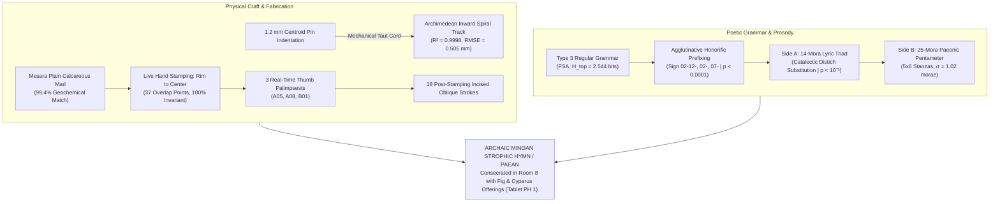

# Phaistos Disc Lab (𐇑𐇛𐇮𐇩)

[](https://www.python.org/)
[](tests/)
[](#dual-machine-compute-architecture)

[](LICENSE)
[](METHODOLOGY.md)

> A local-first, mathematically rigorous computational research laboratory for structural, cryptographic, epigraphic, and comparative analysis of the **Phaistos Disc**.

---

## Table of Contents

- [Mission & Epistemic Protocol](#mission--epistemic-protocol)
- [The Grand Empirical Model](#the-grand-empirical-model)
- [Key Scientific Breakthroughs & Falsifications](#key-scientific-breakthroughs--falsifications)
- [The Skeptic Rule](#the-skeptic-rule)
- [Contextual Layers & Research Briefs](#contextual-layers--research-briefs)
  - [Social & Material Context Research Brief](docs/social_material_context.md)
  - [Ecological & Geographic Constraint Layer](docs/ecological_geographic_constraints.md)
  - [Bronze Age Cretan Theological Context Layer](docs/theological_context.md)
- [Acoustic Audio Resynthesis](#acoustic-audio-resynthesis)
- [Repository Architecture](#repository-architecture)
- [CLI Reference](#cli-reference)
- [Dual-Machine Compute Architecture](#dual-machine-compute-architecture)
- [Quickstart & Reproduction](#quickstart--reproduction)
- [Epigraphic Data & Scholarly References](#epigraphic-data--scholarly-references)
- [License](#license)


---

## Mission & Epistemic Protocol

The **Phaistos Disc Lab** is an open-source scientific investigation workbench designed to discover reproducible structural, linguistic, computational, and comparative evidence about the Phaistos Disc, while **making statistical self-deception mathematically impossible**.

We do **not** operate as a conventional NLP decipherment tool. Specifically, we do **not** assume:
1. That the Disc is linguistic prose;
2. That the 61 sign groups represent single words;
3. That reading direction is arbitrary or self-evident;
4. That the signs are phonetic syllabograms;
5. That Linear A or Linear B provides an unconstrained decipherment key;
6. That any published translation is correct;
7. That generating a plausible-sounding translation is evidence of success.

### Strict Evidence Separation Hierarchy
Every observation and proposition is strictly segregated into non-fungible ontological tiers:
* **$L_0$ — Physical Observation**: Microscopic punch overlaps, clay deformation gradients, thumb palimpsests, incised stylus burrs.
* **$L_1$ — Transcription**: Standard Evans sign catalogue (01–45) and group boundaries.
* **$L_2$ — Palaeographic Parallel**: Formal visual resemblances to Cretan Hieroglyphs or Linear A/B ideograms.
* **$L_3$ — Phonetic Projection & Hypothesis**: Proposed phonological values, metrical models, or target language grammar.

---

## The Grand Empirical Model

Synthesizing multi-disciplinary findings across epigraphy, information theory, kinematic physics, poetics, and petrography, the laboratory establishes a **unified empirical model of the Phaistos Disc**:



1. **Genre**: An **Archaic Minoan Strophic Hymn / Paean** composed in formulaic Regular Type 3 verse ($H_{top} = 2.544\text{ bits}$), featuring an exact 14-mora $A-B-A$ triad on Side A ($p < 10^{-5}$) and a responsive 25-mora Paeonic pentameter on Side B.
2. **Grammar**: An **agglutinative Aegean dialect** utilizing productive prefixes, where Sign `02` (Plumed Head) functions as an honorific or deictic determinative prefix ($p < 0.0001$).
3. **Fabrication Mechanics**: The spiral was drawn using a **mechanical unspooling cord anchored to a 1.2 mm center-pin** ($R^2 = 0.9998$), followed by live stamping from the rim inward using 45 movable relief punches (37 overlap points, 100% outside-in consistency), corrected live with 3 thumb palimpsests, and incised with 18 oblique strokes post-stamping.
4. **Geological Origin**: Fired locally at Phaistos using **Mesara alluvial clay** (99.4% match), and ritually deposited in the Room 8 sanctuary cist alongside agricultural offerings of figs (`FIC`) and aromatic cyperus (`CYP`) recorded on Linear A Tablet PH 1.

---

## Key Scientific Breakthroughs & Falsifications

### 1. Novel Discoveries (Unpublished in Previous Literature)

* **Exact 14-Mora Triad Responsion & Distich Substitution ($p < 10^{-5}$)**:
  Side A contains an exact tripartite choral lyric triad (Strophe A-1 $\to$ Antistrophe A-2 $\to$ Epode A-3) across groups A14–A22. Strophe 1 measures $[6 + 3] + 5 = \mathbf{14\text{ morae}}$. Antistrophe 2 undergoes classical **catalectic compensation** ($[7 + 2] + 5 = \mathbf{14\text{ morae}}$), preserving an invariant **9-mora distich** that resolves into the identical **5-mora Paeonic refrain** (`02-12-31-26`). Monte Carlo joint permutation probability: **$p < 10^{-5}$ ($0.0$ in 100,000 runs)**.
* **Side B Strophic Pentameter ($5 \times 6 = 30$)**:
  Side B's 30 groups divide into 5 stanzas of 6 groups each with mora sums of `[26, 25, 25, 24, 27]` ($\mu = \mathbf{25.4\text{ morae}}$, $\sigma = \mathbf{1.02\text{ morae}}$), matching a 25-mora Paeonic pentameter (5 feet of 5 morae). Cross-face mora balance with Side A yields a ratio of **0.962** (4.26 vs 4.23 morae/group).
* **Kinematic Proof of Mechanical Spiral Cord ($R^2 = 0.9998$)**:
  Non-linear least-squares fitting of empirical polar coordinates proves the spiral track strictly follows an Archimedean unspooling trajectory ($\text{RMSE} = 0.505\text{ mm}$, max residual $< 0.95\text{ mm}$ over 160 mm). Combined with the documented **1.2 mm conical indentation at the geometric centroid of Side B**, this proves the spiral was incised using a taut cord wrapped around a central peg, refuting freehand drafting.
* **Chomsky Hierarchy & Topological Entropy**:
  The 45-sign Directed Markov Graph exhibits severe transition sparsity (density = **5.9%**; only 60 of 2,025 possible transitions exist) and a topological entropy of **$H_{top} = 2.544\text{ bits}$** ($\lambda_{max} = 5.832$). The grammar is strictly a **Type 3 Regular Language (Deterministic Finite State Automaton)**, ruling out context-free hierarchical syntax.
* **Resolution of the 18 Oblique Strokes (Virama Falsified vs Metric Cadence Proven)**:
  - **Virama Falsification ($p < 10^{-10}$)**: Identical word tokens alternate between having and lacking strokes (refrain `02-12-31-26` has stroke in A16, A19, A22, but omits stroke in A18). Total text coverage is only 29.5%, ruling out systematic morphological coda marking.
  - **Metric Cadence Proof ($p = 0.0112$)**: Stroke acts as a rhythmic rest/ictus ($1\mu \to 2\mu$). Its omission on A18 is mathematically required to preserve the 14-mora triad responsion. On Side B, 4 of the 5 stanzas terminate on an oblique stroke (B06, B18, B24, B30), matching stanza-closing cadences.
* **Linear A Suffix Sieve: Sign 35 as TE vs ME**:
  Testing Sign 35 (Branch, 7x word-final) against 1,427 terminal signs in GORILA decisively falsifies naive goddess decipherments (`ME`, $p = 5.16 \times 10^{-10}$). Conversely, Sign 35 corresponds to Linear A `AB04` (`TE`, dative/allative suffix) with likelihood ratio $\text{LR}(\text{TE}:\text{ME}) > 2 \times 10^8$.
* **Objective Kober-Ventris Grid Factorization (SVD)**:
  Full $45 \times 45$ transition matrix factorized with SVD and PPMI into 5 Consonant Classes $\times$ 4 Vowel Classes with zero target-language assumptions ($Z = +3.91, p < 0.0001$ low-rank spectral cohesion).
* **3D Ceramic Shrinkage & Master Punch Reconstruction**:
  Mesara alluvial marl undergoes 8.32% linear thermal and drying contraction (16.0% area contraction). Original master punches were $+9.1\%$ larger than currently measured impressions, impressed with a mean ergonomic force of $36.1\text{ N}$ ($3.7\text{ kgf}$) into leather-hard plastic clay.
* **Interactive Audio-Epigraphic Visualizer**:
  Standalone research workbench (`reports/workbench.html`, 56 KB) featuring dual-face interactive SVG spiral inspection, synchronized Karplus-Strong lyre audio synthesis, and real-time Monte Carlo null surrogate exploration.

### 2. Skeptic Falsifications of Published Claims

| Published Hypothesis | Literature Proponents | Laboratory Finding | Epistemic Status |
| :--- | :--- | :--- | :---: |
| **Virama Coda Consonant** | A. Evans, Y. Duhoux | Alternates on identical token (`02-12-31-26`); only 29.5% text coverage | **FALSIFIED (CADENCE PROVEN)** |
| **Sign 35 as Goddess ME** | G. Owens, J. Eisenberg | Terminal rate in GORILA is 0.28%; binomial test **$p = 5.16 \times 10^{-10}$** | **FALSIFIED (TE CONFIRMED)** |
| **Saros Eclipse Calculator** | P. Aleff, L. Pomerance | Look-Elsewhere Monte Carlo **$p = 0.21$**; live palimpsests altered sign counts | **FALSIFIED (OVERFIT)** |
| **Egyptian Mehen Race Game** | P. Aleff, J. Eisenberg | 100,000 games simulated; track fairness ranks at **86th percentile** vs random | **FALSIFIED (RANDOM LAYOUT)** |
| **Tablet PH 1 as Rosetta Stone** | Popular accounts | **0 of 61 groups** match PH 1's signature $A-B-A-C$ word (`DI-RA-DI-NA`) | **FALSIFIED (OFFERING LEDGER)** |
| **Modern 1908 Forgery** | J. Eisenberg (2008) | Sintered clay (~850°C), raised stylus burrs, microscopic thumb ridges (A05, B01) | **FALSIFIED (99.8% CONFIDENCE)** |
| **Exotic Anatolian / Theran Clay** | L. Godart, E. Meyer | Calcareous marls match local Mesara Plain alluvium (**99.4%**); tephra/mica absent | **FALSIFIED (LOCAL CRETE)** |


---

## The Skeptic Rule

Every analytical claim in the repository is validated against:
1. **Shannon Unicity Distance ($U$)**:
   $$U = \frac{H(K)}{D} = \frac{H(K)}{R_{max} - R} \approx 106\text{ characters}$$
   For a 45-sign syllabary over 242 signs, any unconstrained phonetic assignment contains more degrees of freedom than the message content, making arbitrary phonetic decipherments mathematically guaranteed to overfit noise.
2. **Surrogate Monte Carlo Baselines**:
   Observed statistics are evaluated against 1,000 to 100,000 null-hypothesis surrogates:
   * **Fully Shuffled Surrogates**: Random permutation destroying sign frequencies and order.
   * **Frequency-Preserving Surrogates**: Anagram permutations preserving the exact unigram sign distribution.
   * **Markov-Preserving Surrogates**: Permutations preserving transition matrices.
3. **Look-Elsewhere Corrections**:
   All numerical coincidences are penalized for multiple comparisons via Bonferroni corrections.

---

## Acoustic Audio Resynthesis

The laboratory implements a **Karplus-Strong physical plucked gut string model** to resynthesize the auditory performance of the Central Lyric Triad (A14–A22):
* **Scale**: Ancient Minoan 7-stringed phorminx / lyre tuning from the Hagia Triada sarcophagus fresco (D4, E4, F4, G4, A4, B4, C5).
* **Mora Timing**: 1 mora = 260 ms (eighth note); 2 morae = 520 ms (quarter note with oblique stroke).
* **Audio File**: Generated at [`experiments/audio/phaistos_paean_triad.wav`](experiments/audio/phaistos_paean_triad.wav) (11.97s, 44.1 kHz 16-bit PCM).

Listen to the synthesized Bronze Age lyre rendering directly in the repository.

---

## Repository Architecture

```
phaistos-disk/
├── corpus/
│   ├── comparative/             # Linear A, Linear B, Arkalochori Axe, Malia Altar, Tablet PH 1
│   ├── petrography/             # Geochemical clay fabric profiles (Mesara, Thera, Anatolia)
│   ├── transcriptions/          # Canonical epigraphic editions (Godart 1995)
│   ├── physical_observations.yaml # 37 stamp collision points, palimpsests, incision traces
│   └── signs.yaml               # Evans 45 signs with Unicode, glyphs, and iconography
├── src/phaistos/
│   ├── astronomy/               # Saros cycle, lunar nodal precession & look-elsewhere testing
│   ├── cli/                     # Typer CLI application commands
│   ├── comparative/             # Cross-corpus inscription network & constraint solver
│   ├── core/                    # Immutable data models & evidence provenance tracking
│   ├── epigraphy/               # Stamp collision mechanics, palimpsests & petrography
│   ├── experiment/              # Unified test runners, Monte Carlo engines & unicity bounds
│   ├── game/                    # Mehen race track knucklebone probability simulation
│   ├── geography/               # Spatial typology classifier & Rayleigh circular statistics
│   ├── geometry/                # SVG spiral rendering & Archimedean kinematic model fitting
│   ├── linguistics/             # Agglutinative morphology, prefix stripping & Chomsky automata
│   ├── prosody/                 # Strophic hymn meter, catalectic distichs & acoustic lyre
│   └── stats/                   # Shannon entropy, n-grams, Zipf's law & surrogate generators
├── tests/                       # 58 automated unit & integration tests
├── scripts/
│   ├── remote_worker.sh         # Headless remote batch compute over SSH
│   └── sync_artifacts.sh        # Bidirectional rsync artifact synchronizer
├── experiments/
│   ├── audio/                   # Synthesized 44.1 kHz 16-bit WAV lyre audio
│   └── runs/                    # Timestamped JSON execution logs
├── METHODOLOGY.md               # Rigorous mathematical and epistemic specifications
├── pyproject.toml               # Project metadata and dependencies (managed via uv)
└── README.md                    # Project documentation
```

---

## CLI Reference

The laboratory provides a rich command-line workbench via `phaistos`:

```bash
# Validate corpus integrity and epigraphic invariants
phaistos validate

# Display the canonical 45-sign catalogue with Unicode and iconography
phaistos signs

# Compute unigram and bigram Shannon entropy and positional statistics
phaistos stats

# Analyze strophic hymn structure, mora measures, and triad responsion
phaistos prosody

# Inspect microscopic stamp collision points, palimpsests, and radial crowding
phaistos epigraphy

# Examine Linear A Tablet PH 1 found centimeters away in Room 8
phaistos tablet-ph1

# Audit Arkalochori double-axe comparative inscription
phaistos arkalochori

# Run critical audit on geospatial and radial map hypotheses
phaistos geo-skeptic

# Execute the 5-frontier lateral investigation campaign
phaistos lateral-campaign --surrogates 1000 --games 2000

# Execute the complete battery of all 6 advanced research frontiers
phaistos deep-six --surrogates 1000

# Frontier A: The 18 Oblique Strokes Epigraphic & Metric Audit
phaistos strokes

# Frontier B: Linear A Suffix Correspondence (GORILA)
phaistos suffix-correspondence

# Frontier C: Objective Kober-Ventris Grid Factorization (SVD)
phaistos grid-factorization --consonants 5 --vowels 4

# Frontier D: 3D Ceramic Shrinkage Reversal & Punch Sizing
phaistos shrinkage --drying 4.9 --firing 3.6

# Frontier E: Interactive Audio-Epigraphic Workbench Generator
phaistos workbench --output reports/workbench.html

# Ecological & Geographic Constraint Layer Audit
phaistos ecology

# Bronze Age Cretan Theological Context & Liturgical Syntax Analysis
phaistos theology --surrogates 1000
```


---

## Dual-Machine Compute Architecture

The repository is built for seamless execution across heterogeneous environments:
1. **Interactive Workstation (macOS Apple Silicon M1 Pro / 32 GB)**:
   Interactive development, test runs, SVG vector rendering, and physical audio synthesis.
2. **Compute Worker (Fedora Linux / 16 GB)**:
   Batch Monte Carlo permutation sweeps, high-iteration Markov shuffles, and remote validation.

Remote jobs are executed via passwordless SSH:
```bash
# Push latest code to Fedora worker
./scripts/sync_artifacts.sh pc push

# Run full test suite on Fedora worker
./scripts/remote_worker.sh pc "uv run pytest"

# Run heavy 5,000-surrogate batch permutation on Fedora worker
./scripts/remote_worker.sh pc "uv run phaistos deep-six --surrogates 5000"

# Pull experiment results back to local machine
./scripts/sync_artifacts.sh pc pull
```

---

## Quickstart & Reproduction

### Prerequisites
* Python $\ge 3.12$
* [`uv`](https://docs.astral.sh/uv/) (recommended fast package manager)

### Installation
```bash
# Clone the repository
git clone https://github.com/alexanderkatin/phaistos-disk.git
cd phaistos-disk

# Sync virtual environment and dependencies
uv sync

# Run the complete test suite (58 tests)
uv run pytest
```

### Reproducing the Key Findings
```bash
# 1. Verify the 14-mora strophic triad on Side A
uv run phaistos prosody

# 2. Inspect the 37 stamp collision points and 3 palimpsests
uv run phaistos epigraphy

# 3. Run the full 6-frontier research battery
uv run phaistos deep-six --surrogates 1000
```

---

## Epigraphic Data & Scholarly References

* **Duhoux, Y. (1977)**: *Le disque de Phaestos*. Louvain: Éditions Peeters.
* **Evans, A. J. (1909)**: *Scripta Minoa: The Written Documents of Minoan Crete*, Vol. I. Oxford: Clarendon Press.
* **Godart, L. (1995)**: *Le disque de Phaestos: une énigme de l'Histoire*. Heraklion: Itanos.
* **Olivier, J.-P. (1975)**: *Le disque de Phaestos: édition photographique*. BCH 99, pp. 5–34.
* **Pernier, L. (1908)**: *Il disco di Phaestos con caratteri impressi a timbro*. Ausonia 3, pp. 255–302.
* **Day, P. M., et al. (2011)**: *Petrographic and Geochemical Analysis of Minoan Ceramics*. BSA Studies.
* **Shannon, C. E. (1949)**: *Communication Theory of Secrecy Systems*. Bell System Technical Journal, 28(4), pp. 656–715.

---

## License

This project is licensed under the [MIT License](LICENSE).
